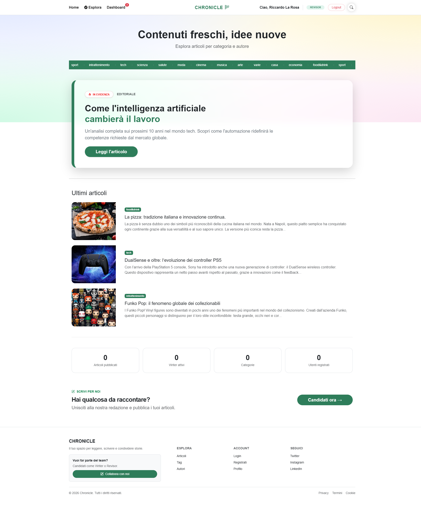
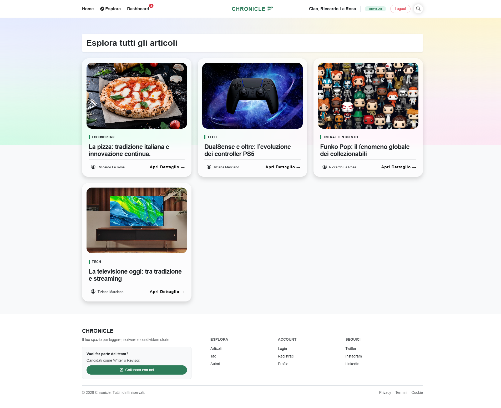
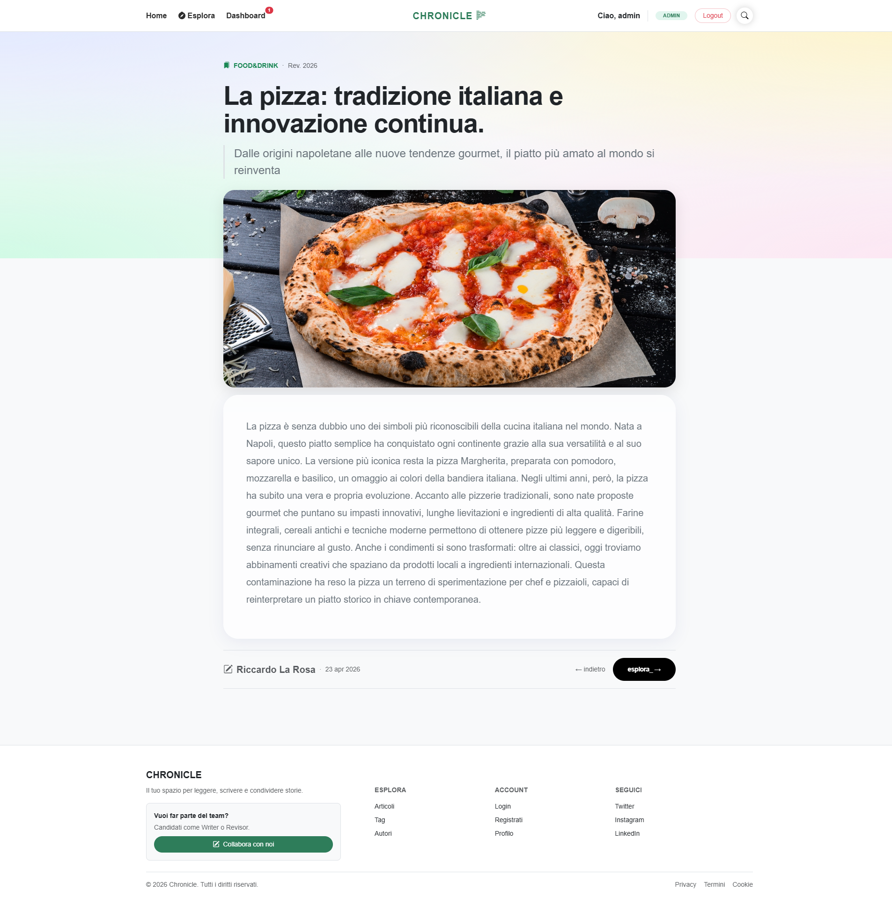
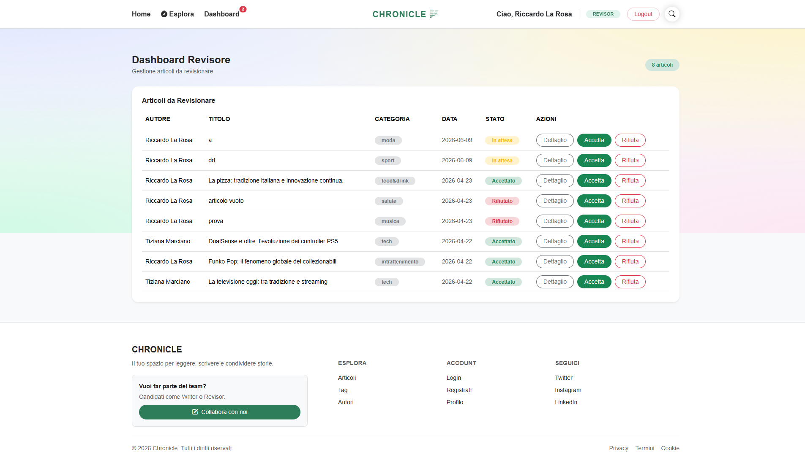
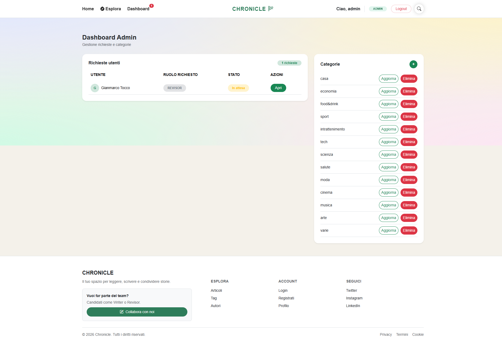
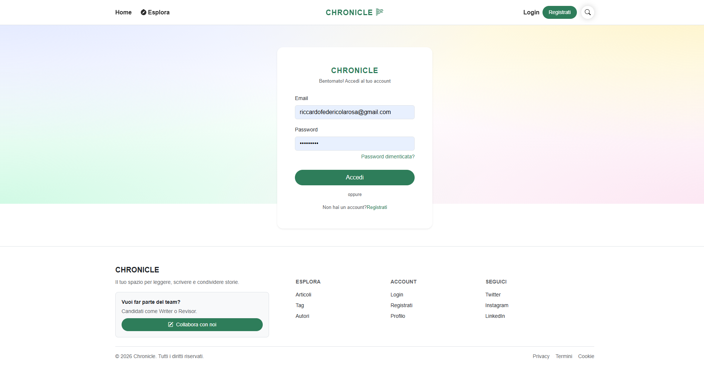
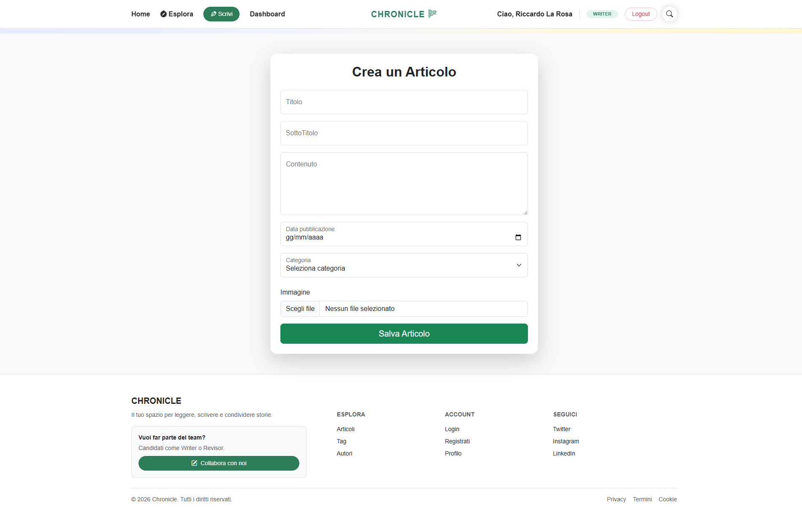
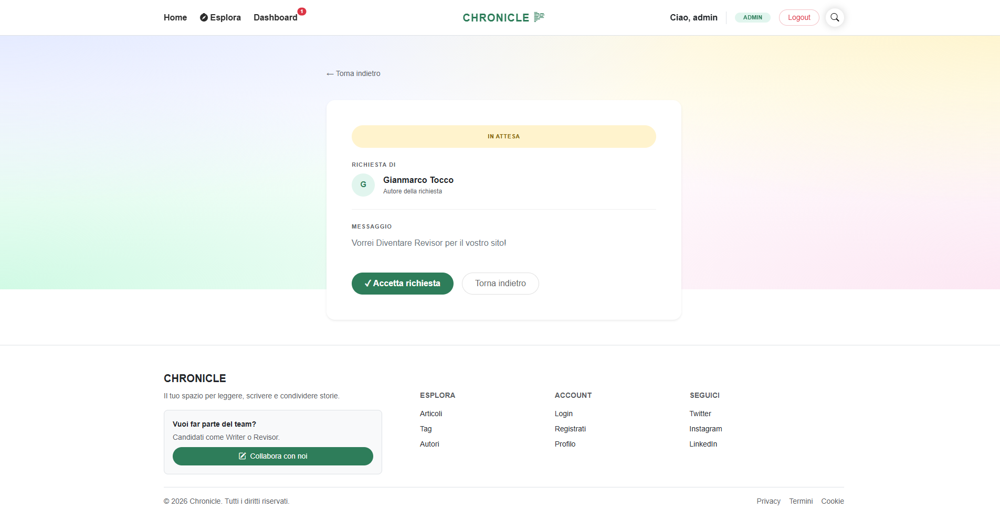
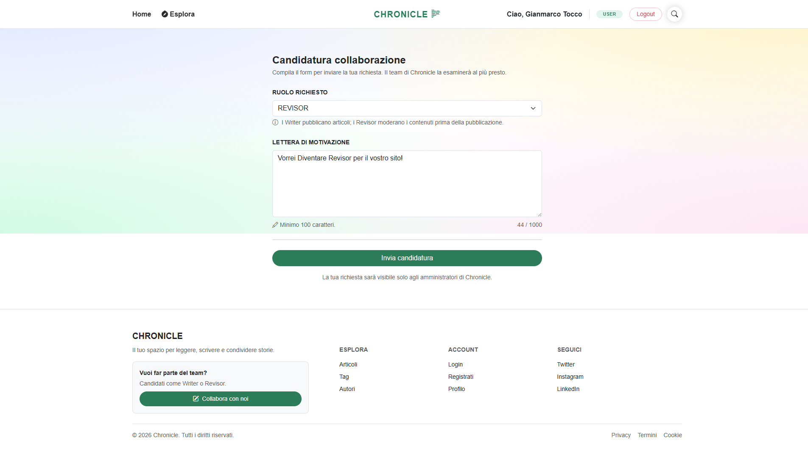

# 📰 Chronicle

Piattaforma editoriale multi-ruolo con sistema di moderazione dei contenuti.
Gli autori scrivono articoli, i revisori approvano i contenuti prima della pubblicazione, l'admin gestisce l'intera piattaforma e le categorie.


---

## Screenshot

**Homepage** — articoli in evidenza, ultime uscite, filtro per categoria



**Catalogo articoli** — griglia card con immagine, categoria e autore



**Dettaglio articolo** — layout editoriale con immagine hero e breadcrumb



**Dashboard Revisore** — lista articoli in attesa con azioni Accetta / Rifiuta



**Dashboard Admin** — gestione richieste collaborazione e categorie



---

## Funzionalità

- Autenticazione con Spring Security (registrazione, login, sessioni)
- Tre ruoli distinti: **Writer**, **Revisor**, **Admin**
- Flusso di moderazione: bozza → in revisione → pubblicato
- CRUD completo degli articoli con upload immagine e selezione categoria
- Dashboard dedicata per ogni ruolo con notifiche in tempo reale
- Sistema di candidatura per diventare Writer o Revisor
- Filtro articoli per categoria con barra di navigazione
- Interfaccia responsive con design pulito e sfondo gradiente

---

## Tech Stack

| Layer | Tecnologie |
|-------|-----------|
| Backend | Java 17, Spring Boot, Spring MVC |
| Sicurezza | Spring Security |
| ORM | Spring Data JPA, Hibernate |
| Template engine | Thymeleaf |
| Database | MySQL 8 |
| Build | Maven |

---

**Prerequisiti:** Java 17+, Maven, MySQL

```bash
git clone https://github.com/RiccardoLaRosa/Chronicle.git
cd Chronicle
```

### Credenziali di test

| Ruolo | Email | Password |
|-------|-------|----------|
| Admin | admin@chronicle.com | password |
| Revisor | revisor@chronicle.com | password |
| Writer | writer@chronicle.com | password |

> Modifica i valori nel seeder se differenti.

---

## Struttura del progetto

```
src/main/java/
├── controller/     # Spring MVC controllers (ArticleController, AdminController...)
├── model/          # Entity JPA (Article, User, Category, Role, CareerRequest...)
├── repository/     # Spring Data JPA interfaces
├── service/        # Business logic
└── security/       # Spring Security configuration

src/main/resources/
├── templates/      # Thymeleaf views
└── application.properties
```

---

## Galleria

<table>
  <tr>
    <td align="center"><b>Login</b></td>
    <td align="center"><b>Crea articolo</b></td>
  </tr>
  <tr>
    <td></td>
    <td></td>
  </tr>
  <tr>
    <td align="center"><b>Candidatura collaborazione</b></td>
    <td align="center"><b>Dettaglio richiesta (Admin)</b></td>
  </tr>
  <tr>
    <td></td>
    <td></td>
  </tr>
</table>

---

## Autore

**Riccardo Federico La Rosa**
[](https://www.linkedin.com/in/riccardo-federico-la-rosa-4999551ab/)
[](https://github.com/RiccardoLaRosa)
